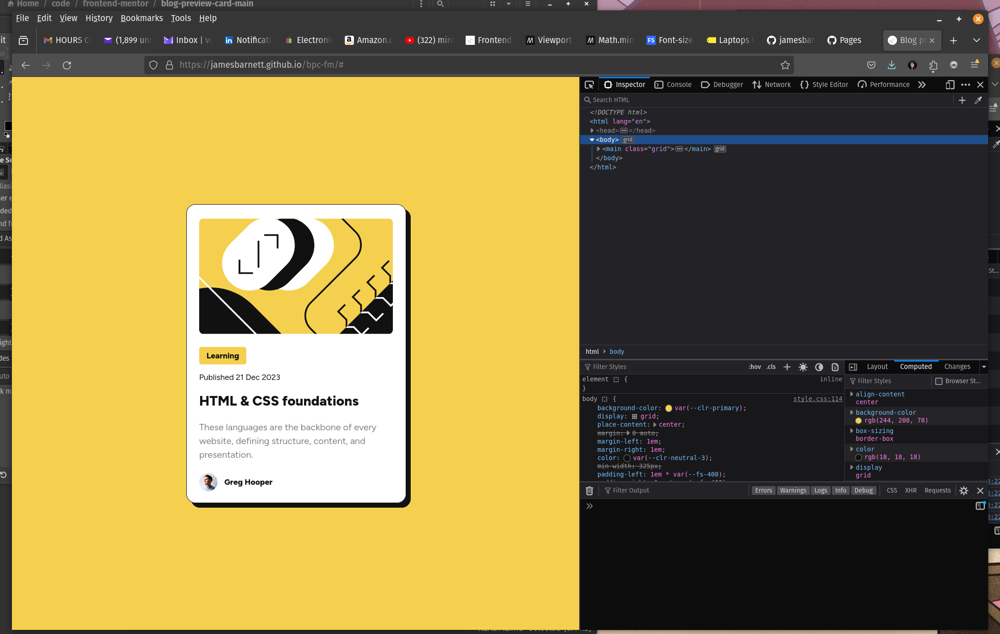

# Frontend Mentor - Blog preview card solution

This is a solution to the [Blog preview card challenge on Frontend Mentor](https://www.frontendmentor.io/challenges/blog-preview-card-ckPaj01IcS). Frontend Mentor challenges help you improve your coding skills by building realistic projects. 

## Table of contents

- [Overview](#overview)
  - [The challenge](#the-challenge)
  - [Screenshot](#screenshot)
  - [Links](#links)
- [My process](#my-process)
  - [Built with](#built-with)
  - [What I learned](#what-i-learned)
  - [Continued development](#continued-development)
  - [Useful resources](#useful-resources)
- [Author](#author)
- [Acknowledgments](#acknowledgments)

**Note: Delete this note and update the table of contents based on what sections you keep.**

## Overview

### The challenge

Users should be able to:

- See hover and focus states for all interactive elements on the page

### Screenshot

Add a screenshot of 
### Links

- Solution URL: [Github](https://github.com/jamesbarnett/bcp-fe)
- Live Site URL: [Github Page](https://jamesbarnett.github.io/bpc-fm/)

## My process

### Built with

- Semantic HTML5 markup
- CSS custom properties
- CSS Grid
- Mobile-first workflow
- Vite

### What I learned

- More familiarity with calc, clamp, min, max.
- Responsive font strategies.
- Improved my grasp on "new-to-me" HTML5 semantic tags

### Continued development

- Need to improve using figma as an analysis tool
- Not entirely sure I am understanding the responsive requirements as intended
  by the authors
- More awareness of HTML5 semantic tags.

### Useful resources
- Kevin Powell youtube channel
- Steve Griffith - Prof3ssorSt3v3 youtube channel

## Author

- Frontend Mentor - [@jamesbarnett](https://www.frontendmentor.io/profile/jamesbarnett)
